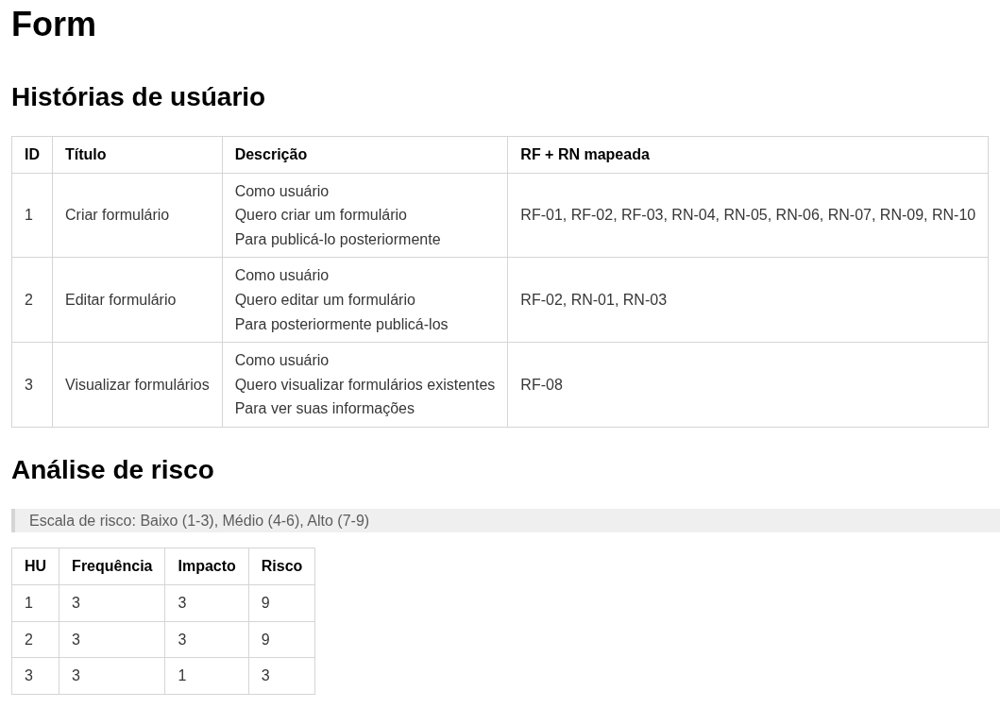

# Objetivo do Projeto

O projeto tem como objetivo ampliar meus conhecimentos em qualidade de software. Neste foi desenvolvido um sistema de formulários, no qual formulários podem ser criados e publicados para receber respostas.

Mais do que apenas implementar funcionalidades, o foco é aplicar conceitos de engenharia de software e avaliar como eles impactam a evolução do sistema ao longo do tempo.

# Para que serve qualidade de software?

A qualidade de software tem como objetivo assegurar que o sistema

- Atenda aos requisitos funcionais, não funcionais e regras de negócio
- Seja manutenível, escalável e testável
- Tenha baixo custo de manutenção futura

Norma amplamente citada na engenharia de software **ISO/IEC-25010**, que define um modelo de qualidade composto por diversas características, como desempenho, confiabilidade, usabilidade, segurança e manutenibilidade.

Uma forma intuitiva de entender a ISO/IEC-25010 é compará-la ao selo de uma geladeira.

Quando você compra uma geladeira, ela não é avaliada apenas por gelar. Existem diversos critérios que você utiliza para mensurar a qualidade do produto como por exemplo a eficiência energética, durabilidade, nível de ruído, capacidade interna, etc.

A norma faz exatamente isso com software. Ela define um conjunto de características que funcionam como um "selo de qualidade".

Exemplos:

- **Desempenho**: como o sistema lida com múltiplos usuários? -> como a geladeira gela rápido mantendo estabilidade térmica?
- **Manutenibilidade**: consigo alterar uma regra de negócio sem quebrar o resto do sistema? -> como trocar uma peça da geladeira sem desmontar tudo?

# Para que servem testes de software?

Os testes existem para reduzir incerteza. Verifica se o sistema se comporta como esperado e ajuda a identificar defeitos antes de chegar ao usuário final.

Os testes ajudam a

- Validar requisitos
- Proteger o sistema contra regressões
- Aumenta confiança para manutenção
- Reduz custo para correções no futuro

A relação entre qualidade e testes é direta. Se a qualidade busca garantir alinhamento aos requisitos e sustentabilidade do sistema ao longo do tempo, os testes são um dos principais mecanismos para mensurar e preservar essa qualidade continuamente.

Alguns tipos de testes

- **Unitários**: valida pequenas partes do sistema isoladamente
- **Interação**: verifica se 2 ou mais componentes funcionam juntos corretamente
- **End to end**: avalia o comportamento a aplicação como um todo

# Técnicas antes de chegar no código

Software não é somente um pedaço de código que faz algo, software é um conjunto de artefatos que servem para atender uma dor do usuário. Antes da implantação existem uma série de técnicas aplicadas, e no contexto ágil, elas ocorrem de forma incremental. Segue abaixo técnicas de documentação utilizadas

## Histórias de usuário + Análise de risco

Com base nos requisitos funcionais e regras de negócio, desenvolvi histórias de usuário para mostrar a visão do usuário final, evitando ambiguidade e inconsistência. A partir das histórias de usuário geradas, fiz uma análise de riso utilizando a técnica que gera `risco = probabilidade X impacto` (probabilidade seria a frequência com que a operação ocorre e impacto seria o impacto da falha) e com base no resultado, pude definir uma estratégia de testes futura, direcionando os esforços onde a falha é critica

## Casos de testes

Utilizei BDD para estruturar os casos de teste. Direcionei meus esforços para cobrir os testes de acordo com o quão crítica é aquela funcionalidade. Se for muito crítica, cobrir todos os casos: happy path, cenário funcional, cenário de exceção, cenário de borda.

## Modelagem

Utilizando o modelo C4 desenvolvi um rascunho da arquitetura. Servindo para avaliar arquitetura e identificar falhas conceituais.

> Nível 4 - código
> 

# Implementação

Finalmente chegando na implementação, podemos utilizar a documentação levantada anteriormente para construir nosso sistema.

## Estratégia de testes

Decidi utilizar uma abordagem de domínio rico, onde consigo encapsular minhas regras de negócio no domínio. Essa abordagem aumentou a testabilidade do código e velocidade dos testes pois pude validar maior parte dos cenários de teste no teste unitário

## Tecnologias Utilizadas

### Backend

- Java 21
- Spring Boot 4.0.3
- MongoDB
- Maven
- Testcontainers
- RestAssured
- JaCoCo
