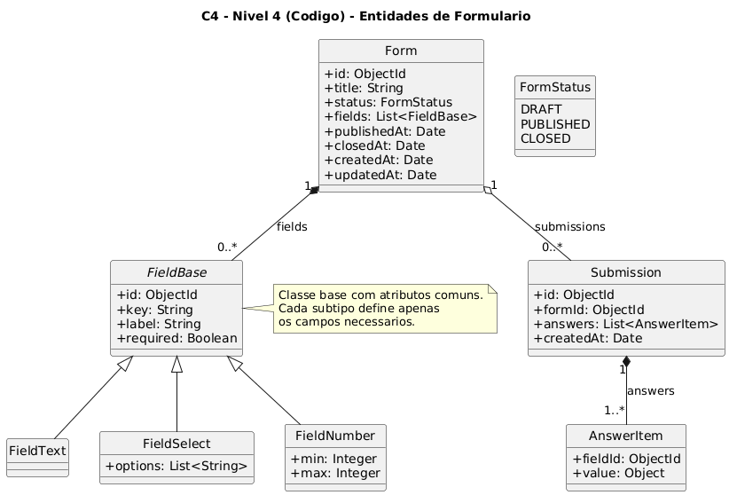

# Objetivo do Projeto

O projeto tem como objetivo ampliar meus conhecimentos em qualidade de software. Neste foi desenvolvido um sistema de formulários, no qual formulários podem ser criados e publicados para receber respostas.

Mais do que apenas implementar funcionalidades, o foco é aplicar conceitos de engenharia de software e avaliar como eles impactam a evolução do sistema ao longo do tempo.

# Para que serve qualidade de software?

A qualidade de software tem como objetivo assegurar que o sistema

- Atenda aos requisitos funcionais, não funcionais e regras de negócio
- Seja manutenível, escalável e testável
- Tenha baixo custo de manutenção futura

Norma amplamente citada na engenharia de software **ISO/IEC-25010**, que define um modelo de qualidade composto por diversas características, como desempenho, confiabilidade, usabilidade, segurança e manutenibilidade.

Uma forma intuitiva de entender a ISO/IEC-25010 é compará-la ao selo de uma geladeira.

Quando você compra uma geladeira, ela não é avaliada apenas por gelar. Existem diversos critérios que você utiliza para mensurar a qualidade do produto com por exemplo a eficiência energética, durabilidade, nível de ruído, capacidade interna, etc.

A norma faz exatamente isso com software. Ela define um conjunto de características para que funcionam como um "selo de qualidade"

Exemplos:

- **Desempenho**: como o sistema lida com múltiplos usuários? -> como a geladeira gela rápido mantendo estabilidade térmica?
- **Manutenibilidade**: consigo alterar uma regra de negócio sem quebrar o resto do sistema? -> como trocar uma peça da geladeira sem desmontar tudo?

# Para que servem testes de software?

Os testes existem para reduzir incerteza. Verifica se o sistema se comporta como esperado e ajuda a identificar defeitos antes de chegar ao usuário final.

Os testes ajudam a

- Validar requisitos
- Proteger o sistema contra regressões
- Aumenta confiança para manutenção
- Reduz custo para correções no futuro

A relação entre qualidade e testes é direta. Se a qualidade busca garantir alinhamento aos requisitos e sustentabilidade do sistema ao longo do tempo, os testes são um dos principais mecanismos para mensurar e preservar essa qualidade continuamente.

Alguns tipos de testes

- **Unitários**: valida pequenas partes do sistema isoladamente
- **Interação**: verifica se 2 ou mais componentes funcionam juntos corretamente
- **End to end**: avalia o comportamento a aplicação como um todo

# Técnicas antes de chegar no código

A software não é somente um pedaço de código que faz algo, software é um conjunto de artefatos que servem para atender uma dor do usuário. Antes da implantação existem uma série de técnicas aplicadas, e no contexto ágil, elas ocorrem de forma incremental.

## Engenharia de requisitos

- Casos de uso
- Histórias de usuário
- Prototipação

Evita ambiguidade e inconsistência.

## Modelagem

- Diagrama de classes
- Diagrama de casos de uso

Serve para avaliar arquitetura e identificar falhas conceituais. Utiliza bastante linguagem UML.

## Revisão

- Peer review
- Walkthrough
- Fagan Inspection

Removem defeitos antes de chegar no código. São métodos de análise aplicados a requisitos e modelos.

## Análise de riscos

- Identificação de riscos técnicos
- Avaliação do impacto
- Planejamento de mitigação

Auxilia na definição da estratégia de testes futura, os esforços precisam ser direcionados onde a falha é critica

# Implementação

Neste repositório estou aplicando os conceitos usando um sistema de formulários. Com o objetivo de estudo com clareza e com foco no conceito, é um sistema sem login de usuário e sem regras rígidas para agilizar o código de exemplo

## [Requisitos e regras de negócio](./docs/requisitos.md)

## Modelo C4
Para documentar a arquitetura de forma clara, adotei o modelo C4.

### Nível 4 - Código

## [User Stories + BDD](./docs/user-histories.md)

---

# Implementação
Para essa prova de conceito decidi utilizar Java com Spring boot

## Tecnologias Utilizadas

### Backend
- Java 21
- Spring Boot 4.0.3
- MongoDB 7
- Maven
- Testcontainers
- RestAssured
